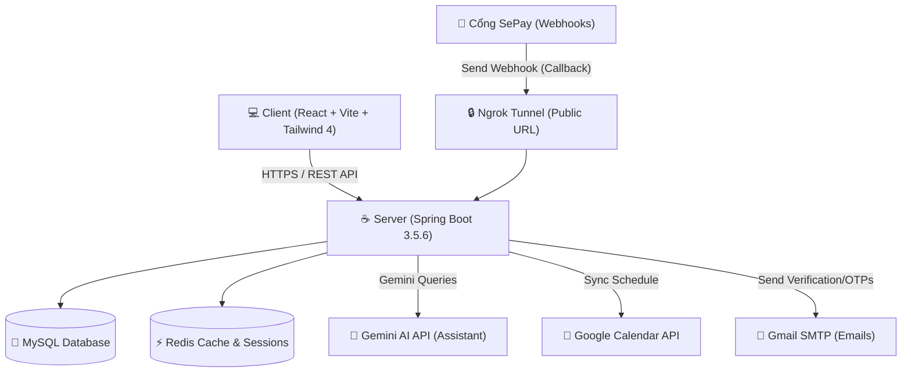

# KREDO Shop - Nền Tảng Thương Mại Điện Tử Thông Minh Tích Hợp AI

Chào mừng bạn đến với **KREDO Shop**, hệ thống cửa hàng mua sắm thời trang trực tuyến tích hợp trợ lý ảo thông minh Gemini AI và cổng thanh toán tự động qua mã QR ngân hàng. Dự án được phát triển theo mô hình tách biệt rõ ràng giữa **Backend (Spring Boot)** và **Frontend (React)**.

---

## 🗺️ 1. Sơ Đồ Kiến Trúc Hệ Thống (Architecture Overview)

Dưới đây là sơ đồ luồng dữ liệu của dự án giữa các thành phần nội bộ và các dịch vụ API bên ngoài:



---

## 🛠️ 2. Yêu Cầu Hệ Thống (System Requirements)

Để chạy dự án này trên máy tính của bạn, cần chuẩn bị trước các công cụ sau:
*   **Java Development Kit (JDK)**: Phiên bản **21** trở lên.
*   **Node.js**: Phiên bản **18.x** trở lên kèm theo `npm`.
*   **Docker Desktop** (Khuyên dùng để triển khai nhanh các dịch vụ database và cache).
*   **MySQL Server** (phiên bản **8.0+**) và **Redis** (nếu không dùng Docker).
*   **Ngrok** (để chạy thử cổng thanh toán SePay dưới môi trường localhost).

---

## 🗄️ 3. Hướng Dẫn Cài Đặt Hạ Tầng & Database

Để kết nối cơ sở dữ liệu với Backend, bạn có hai phương án setup dưới đây:

### Cách 1: Sử dụng Docker Compose (Nhanh chóng & Tiện lợi)
Chúng tôi đã cấu hình sẵn tệp [docker-compose.yml](file:///c:/Users/thanh/Desktop/wwwJava/DoAn/docker-compose.yml) ở thư mục gốc chứa cả MySQL và Redis với các thông số khớp hoàn toàn với cấu hình backend:

1. Mở terminal tại thư mục gốc của dự án.
2. Chạy lệnh:
   ```bash
   docker compose up -d
   ```
3. Hệ thống sẽ khởi chạy ngầm:
   *   **MySQL**: Hoạt động tại cổng `3306`, tên database mặc định `kredo_studio`, mật khẩu tài khoản `root` là `123456`.
   *   **Redis**: Hoạt động tại cổng `6379`.

### Cách 2: Setup Database Thủ Công bằng tay
Nếu máy bạn đã cài sẵn MySQL và Redis cục bộ:
1. Mở phần mềm quản lý MySQL (như MySQL Workbench, DBeaver hoặc Navicat) và tạo một database mới tên là `kredo_studio`.
2. Kiểm tra thông tin đăng nhập trong file cấu hình [application.properties](file:///c:/Users/thanh/Desktop/wwwJava/DoAn/kredoshop-be/src/main/resources/application.properties):
   ```properties
   spring.datasource.url=jdbc:mysql://localhost:3306/kredo_studio?createDatabaseIfNotExist=true
   spring.datasource.username=root
   spring.datasource.password=123456
   ```
   *Lưu ý: Hãy thay đổi `spring.datasource.password` thành mật khẩu MySQL trên máy của bạn.*
3. Khởi động dịch vụ Redis trên cổng mặc định `6379` của máy.

### Import Dữ Liệu Mẫu (Seed Data)
Sau khi database hoạt động, chạy các file script SQL nằm trong thư mục `kredoshop-be/scripts` theo thứ tự sau để khởi tạo cấu trúc và dữ liệu sản phẩm:
1. Chạy file [JPA.sql](file:///c:/Users/thanh/Desktop/wwwJava/DoAn/kredoshop-be/scripts/JPA.sql) để tạo toàn bộ bảng và dữ liệu cơ bản.
2. Chạy file [new_products.sql](file:///c:/Users/thanh/Desktop/wwwJava/DoAn/kredoshop-be/scripts/new_products.sql) để thêm sản phẩm phong phú và thực tế vào cửa hàng.

---

## 🔑 4. Cấu Hình Các API Bên Ngoài (External APIs & Webhooks)

Để các tính năng đặc biệt của KREDO Shop hoạt động chính xác, bạn cần bổ sung các cấu hình API tương ứng trong file [application.properties](file:///c:/Users/thanh/Desktop/wwwJava/DoAn/kredoshop-be/src/main/resources/application.properties).

### A. Đồng bộ Hóa đơn với Cổng Thanh Toán SePay (Cách chạy Webhook khi ở Local)
Khi khách hàng quét mã QR chuyển khoản, hệ thống SePay sẽ gửi tín hiệu callback (Webhook) về server của bạn để cập nhật trạng thái hóa đơn là **Đã thanh toán** trong database.
Do server đang chạy local (`localhost:8080`), SePay không thể kết nối trực tiếp. Ta cần dùng **Ngrok** để tạo một public URL:

1. **Khởi động Ngrok Tunnel**:
   Mở terminal mới và chạy lệnh tạo đường hầm trỏ vào cổng backend Spring Boot (8080):
   ```bash
   ngrok http 8080
   ```
2. **Lấy Public URL**:
   Ngrok sẽ hiển thị thông tin như: `Forwarding https://xxxx-xxxx.ngrok-free.app -> http://localhost:8080`. Copy đường link `https://xxxx-xxxx.ngrok-free.app`.
3. **Cấu hình trên SePay Dashboard**:
   * Truy cập tài khoản SePay của bạn, vào mục tích hợp Webhook.
   * Điền URL Webhook của bạn dưới định dạng:
     `https://xxxx-xxxx.ngrok-free.app/api/v1/payment/sepay-callback`
   * Điền API Key (authorization header) do bạn tự chọn.
4. **Cập nhật Backend**:
   Điền API Key của SePay vào cấu hình:
   ```properties
   sepay.api-key=MÃ_API_KEY_CỦA_BẠN
   ```
Khi chuyển khoản thành công, SePay sẽ gửi callback qua URL của Ngrok -> Ngrok tự động định tuyến về backend local -> Cập nhật trực tiếp trạng thái hóa đơn trong database MySQL cục bộ của bạn.

### B. Trợ Lý Ảo Gemini AI (Virtual Assistant Chatbot)
Trò chuyện và hỗ trợ khách hàng tìm kiếm sản phẩm:
1. Truy cập [Google AI Studio](https://aistudio.google.com/) để tạo một API Key miễn phí.
2. Điền API Key vào cấu hình:
   ```properties
   gemini.api.key=MÃ_GEMINI_API_KEY_CỦA_BẠN
   ```

### C. Gmail SMTP (Gửi OTP & Xác Nhận Đơn Hàng)
Hệ thống gửi thư tự động qua giao thức SMTP của Google:
1. Truy cập tài khoản Google của bạn -> Bật **Xác minh 2 bước** (2-Step Verification).
2. Tạo **Mật khẩu ứng dụng** (App Password) dành cho ứng dụng Thư (Mail).
3. Copy mã gồm 16 ký tự và điền vào file cấu hình:
   ```properties
   spring.mail.username=email_cua_ban@gmail.com
   spring.mail.password=mat_khau_ung_dung_16_ky_tu
   ```

### D. Google Calendar API (Đặt lịch & Hẹn giờ)
1. Tạo dự án trên Google Cloud Console, bật thư viện Google Calendar API.
2. Tạo OAuth Client Credentials và tải file JSON về dự án backend.

---

## 🚀 5. Hướng Dẫn Khởi Chạy Ứng Dụng (Run Project)

### Khởi Chạy Backend (Spring Boot)
1. Mở terminal và di chuyển vào thư mục backend:
   ```bash
   cd kredoshop-be
   ```
2. Build và chạy ứng dụng Spring Boot:
   * Trên Windows:
     ```powershell
     .\mvnw.cmd spring-boot:run
     ```
   * Trên macOS/Linux:
     ```bash
     chmod +x mvnw
     ./mvnw spring-boot:run
     ```
3. Backend sẽ chạy tại: [http://localhost:8080](http://localhost:8080).

### Khởi Chạy Frontend (React + Vite)
1. Mở terminal mới và di chuyển vào thư mục frontend:
   ```bash
   cd kredoshop-fe
   ```
2. Cài đặt các gói thư viện cần thiết:
   ```bash
   npm install
   ```
3. Chạy dự án ở chế độ phát triển (Development mode):
   ```bash
   npm run dev
   ```
4. Frontend sẽ chạy tại địa chỉ do Vite cung cấp (mặc định thường là [http://localhost:5173](http://localhost:5173)).

---

## 📐 6. Quy Chuẩn Dự Án (Project Standards)

Để đảm bảo code sạch, thống nhất và dễ bảo trì, tất cả các lập trình viên tham gia dự án cần tuân thủ các quy chuẩn sau:

### Quy Chuẩn Đặt Tên Nhánh & Commit Git (Git Standards)

*   **Quy chuẩn đặt tên nhánh (Branch Naming)**:
    *   Nhánh chính (Stable code): `main` hoặc `master`.
    *   Nhánh tích hợp tính năng: `develop`.
    *   Nhánh làm tính năng mới: `feature/tên-tính-năng` (ví dụ: `feature/wishlist`).
    *   Nhánh sửa lỗi thông thường: `bugfix/tên-lỗi` (ví dụ: `bugfix/cart-quantity`).
    *   Nhánh sửa lỗi khẩn cấp trên production: `hotfix/tên-lỗi`.

*   **Quy chuẩn viết Commit (Conventional Commits)**:
    *   `feat: ...` -> Thêm tính năng mới (ví dụ: `feat: tích hợp API Gemini AI`).
    *   `fix: ...` -> Sửa lỗi (ví dụ: `fix: sửa lỗi hiển thị size sản phẩm`).
    *   `docs: ...` -> Thay đổi/cập nhật tài liệu README, usecases.
    *   `style: ...` -> Thay đổi định dạng code (khoảng trắng, CSS, thụt lề...) không đổi logic.
    *   `refactor: ...` -> Tối ưu hóa cấu trúc code hiện có.

### Quy Chuẩn Thiết Kế REST API (API Standards)

*   **Định dạng URL**: Luôn dùng danh từ ở dạng số nhiều và viết thường (kết nối bằng dấu gạch ngang nếu có nhiều từ).
    *   *Đúng*: `/api/v1/orders`, `/api/v1/product-sizes`
    *   *Sai*: `/api/v1/getOrder`, `/api/v1/productSize`
*   **Sử dụng Phương Thức HTTP (HTTP Methods)**:
    *   `GET`: Đọc thông tin (ví dụ: lấy danh sách sản phẩm yêu thích).
    *   `POST`: Tạo mới tài nguyên (ví dụ: thêm vào giỏ hàng).
    *   `PUT`: Cập nhật toàn bộ tài nguyên.
    *   `PATCH`: Cập nhật một phần tài nguyên (ví dụ: cập nhật số lượng của một mặt hàng).
    *   `DELETE`: Xóa tài nguyên.
*   **Cấu Trúc Phản Hồi Chung (Standard Response Wrapper)**:
    Mọi phản hồi từ backend cần tuân theo định dạng chuẩn sau:
    ```json
    {
      "status": "success",
      "message": "Xử lý thành công",
      "data": { ... }
    }
    ```
*   **Mã Trạng Thái HTTP (HTTP Status Codes)**:
    *   `200 OK`: Truy vấn, cập nhật hoặc xóa thành công.
    *   `201 Created`: Tạo mới thành công (tài khoản, hóa đơn, sản phẩm).
    *   `400 Bad Request`: Dữ liệu gửi lên không hợp lệ (lỗi validation).
    *   `401 Unauthorized`: Người dùng chưa xác thực (thiếu JWT hoặc token hết hạn).
    *   `403 Forbidden`: Người dùng đã đăng nhập nhưng không có quyền truy cập.
    *   `404 Not Found`: Không tìm thấy tài nguyên (sản phẩm, tài khoản...).
    *   `500 Internal Server Error`: Lỗi hệ thống phát sinh ở phía server.

### Quy Chuẩn Code Style (Coding Standards)

*   **Backend (Java)**:
    *   Tên class viết theo PascalCase (ví dụ: `CustomerController`, `OrderDetail`).
    *   Tên biến, phương thức viết theo camelCase (ví dụ: `wishListRepository`, `handleCallback()`).
    *   Sử dụng annotation MapStruct để chuyển đổi DTO và Entity.
    *   Sử dụng Lombok để tự động sinh getter, setter, constructor nhằm giữ code gọn gàng.
*   **Frontend (React)**:
    *   Sử dụng các component dạng hàm (Functional Components) và React Hooks (`useState`, `useEffect`).
    *   Sử dụng các icon từ thư viện `lucide-react` hoặc `react-icons`.
    *   Thiết kế giao diện linh hoạt (Responsive Design) và tối ưu hóa CSS bằng các utility class của Tailwind CSS v4.
