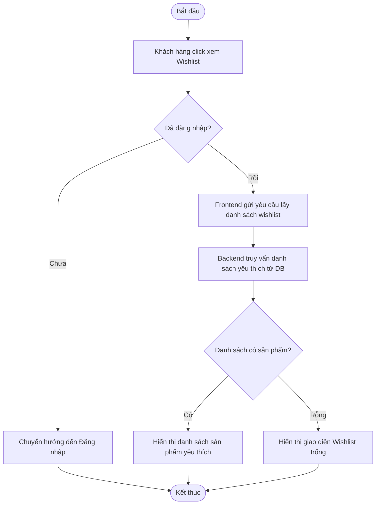
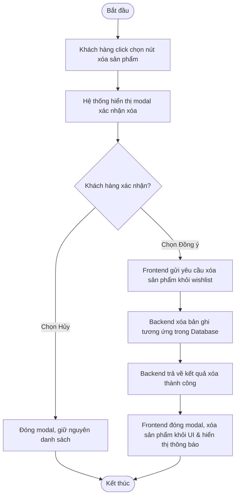
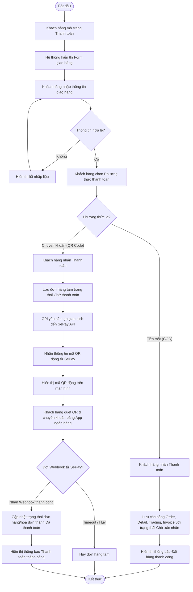
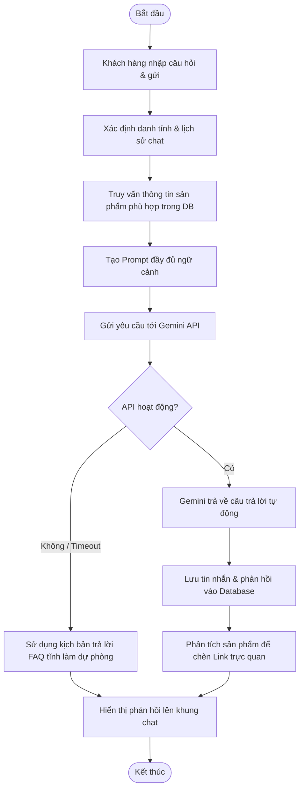
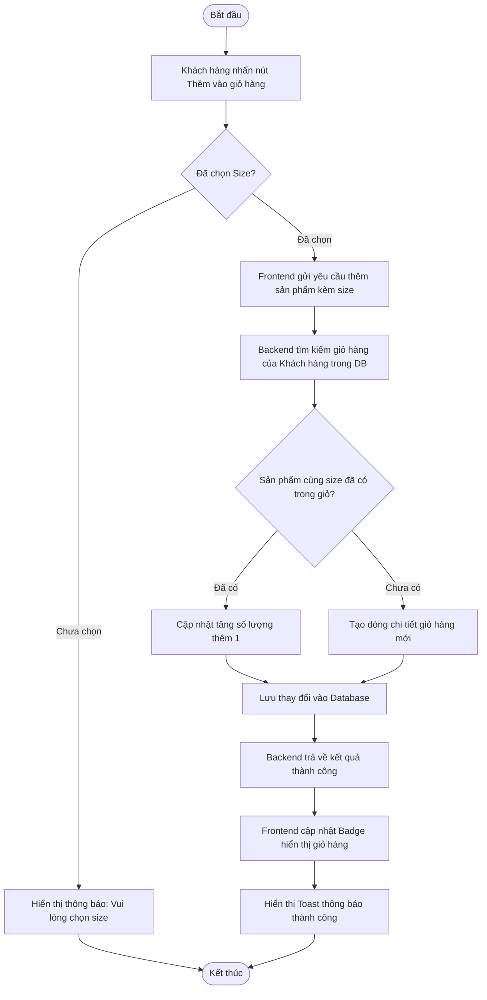
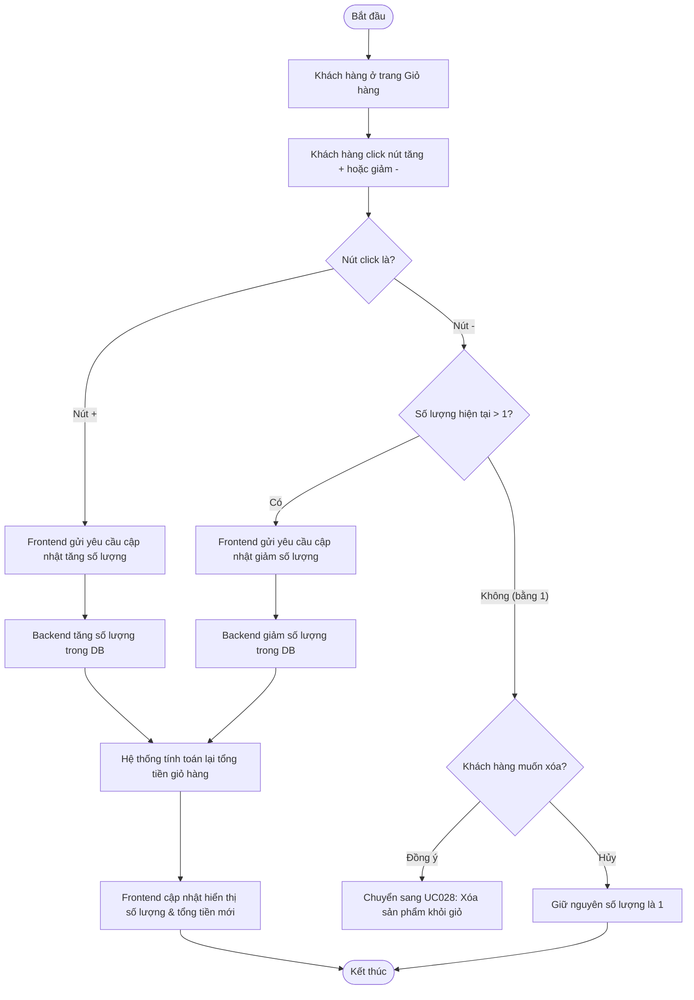
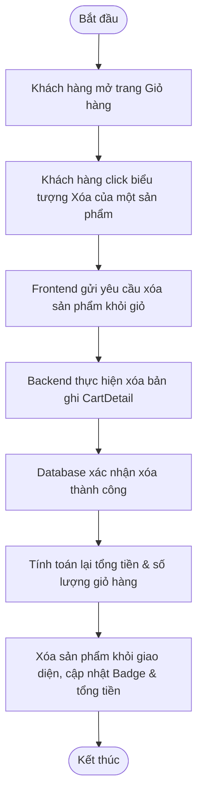
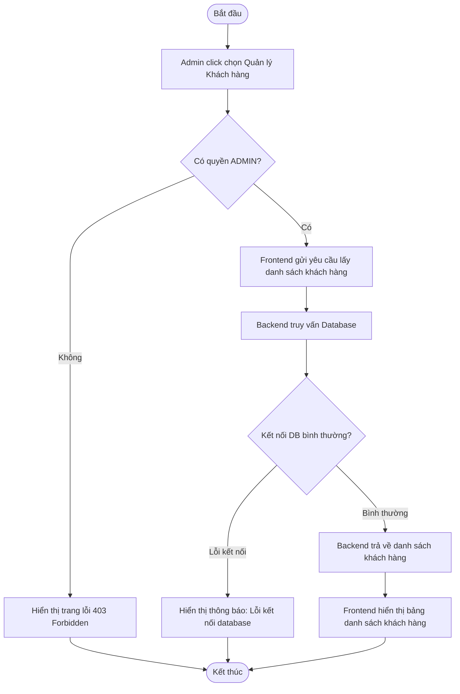
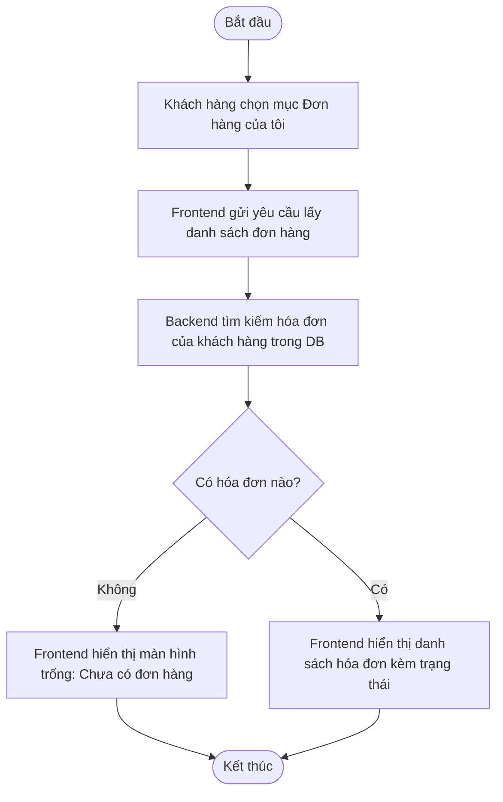
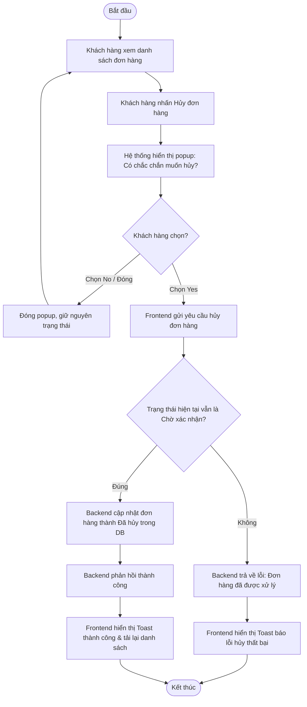

# Biểu đồ Hoạt động (Activity Diagram) & Tuần tự (Sequence Diagram) từ UC022 đến UC032

Tài liệu này tổng hợp toàn bộ **Activity Diagram** và **Sequence Diagram** (sử dụng mã Mermaid.js) cho các Use Case từ UC022 đến UC032 dựa trên đặc tả bạn đã cung cấp.

---

## 📌 UC022: Xem danh sách yêu thích

### 1. Activity Diagram


### 2. Sequence Diagram
```mermaid
sequenceDiagram
    autonumber
    actor KhachHang as Khách hàng
    participant FE as Frontend UI (React)
    participant BE as Backend Controller (Spring Boot)
    participant Service as WishList Service
    participant Repo as WishList Repository
    database DB as Database (MySQL)

    KhachHang->>FE: Click chọn mục Wishlist
    activate FE
    FE->>BE: GET /api/v1/wishlist (JWT Token)
    activate BE
    BE->>BE: Xác thực Token, lấy CustomerId
    BE->>Service: getWishlistByCustomerId(customerId)
    activate Service
    Service->>Repo: findByCustomerId(customerId)
    activate Repo
    Repo->>DB: SELECT * FROM wishlist WHERE customer_id = ?
    activate DB
    DB-->>Repo: Trả về dữ liệu Wishlist
    deactivate DB
    Repo-->>Service: Đối tượng WishList
    deactivate Repo
    Service-->>BE: WishListResponse DTO
    deactivate Service
    BE-->>FE: HTTP 200 OK (Danh sách sản phẩm yêu thích JSON)
    deactivate BE
    FE-->>KhachHang: Hiển thị danh sách sản phẩm yêu thích trên giao diện
    deactivate FE
```

---

## 📌 UC023: Xóa sản phẩm khỏi danh sách yêu thích

### 1. Activity Diagram


### 2. Sequence Diagram
```mermaid
sequenceDiagram
    autonumber
    actor KhachHang as Khách hàng
    participant FE as Frontend UI (React)
    participant BE as Backend Controller (Spring Boot)
    participant Service as WishList Service
    participant Repo as WishListDetail Repository
    database DB as Database (MySQL)

    KhachHang->>FE: Click nút xóa (thùng rác) của một sản phẩm
    activate FE
    FE-->>KhachHang: Hiển thị modal xác nhận xóa
    deactivate FE
    
    alt Khách hàng chọn "Xác nhận" (Yes)
        KhachHang->>FE: Click nút "Xác nhận"
        activate FE
        FE->>BE: DELETE /api/v1/wishlist-detail/{detailId} (JWT Token)
        activate BE
        BE->>Service: removeWishlistDetail(detailId)
        activate Service
        Service->>Repo: deleteById(detailId)
        activate Repo
        Repo->>DB: DELETE FROM wishlist_detail WHERE id = ?
        activate DB
        DB-->>Repo: Xác nhận xóa thành công
        deactivate DB
        Repo-->>Service: Trả về trạng thái thành công
        deactivate Repo
        Service-->>BE: Hoàn thành xóa
        deactivate Service
        BE-->>FE: HTTP 200 OK (Xóa thành công)
        deactivate BE
        FE-->>KhachHang: Cập nhật danh sách trên UI & hiển thị Toast thông báo thành công
        deactivate FE
    else Khách hàng chọn "Hủy" (No)
        KhachHang->>FE: Click nút "Hủy"
        activate FE
        FE-->>KhachHang: Đóng modal, giữ nguyên danh sách
        deactivate FE
    end
```

---

## 📌 UC024: Thanh toán

### 1. Activity Diagram


### 2. Sequence Diagram
```mermaid
sequenceDiagram
    autonumber
    actor KhachHang as Khách hàng
    participant FE as Frontend UI (React)
    participant BE as Backend Controller (Spring Boot)
    participant Service as Order & Payment Service
    database DB as Database (MySQL)
    participant SePay as SePay Gateway (API/Webhook)
    actor BankApp as App Ngân hàng

    KhachHang->>FE: Điền thông tin giao hàng, chọn hình thức thanh toán & ấn "Thanh toán"
    activate FE
    
    alt Trường hợp 1: Chọn thanh toán Tiền mặt (COD)
        FE->>BE: POST /api/v1/orders/checkout (Kèm thông tin giao hàng & phương thức COD)
        activate BE
        BE->>Service: createOrderCOD(dto)
        activate Service
        Service->>DB: Lưu các thực thể (Order, OrderDetail, CustomerTrading, Invoice)
        activate DB
        DB-->>Service: Lưu thành công
        deactivate DB
        Service-->>BE: Đối tượng OrderResponseDTO (Trạng thái: Chờ xác nhận)
        deactivate Service
        BE-->>FE: HTTP 200 OK (Thành công)
        deactivate BE
        FE-->>KhachHang: Clear giỏ hàng, hiển thị trang Đặt hàng thành công
        
    else Trường hợp 2: Chọn thanh toán Chuyển khoản (SePay QR)
        FE->>BE: POST /api/v1/orders/checkout (Kèm thông tin giao hàng & phương thức QR)
        activate BE
        BE->>Service: createOrderQR(dto)
        activate Service
        Service->>DB: Lưu thông tin đơn hàng tạm (Trạng thái: Chờ thanh toán)
        activate DB
        DB-->>Service: Lưu thành công
        deactivate DB
        Service->>SePay: POST /api/v1/sepay/payment-request (Số tiền, Mã đơn hàng)
        activate SePay
        SePay-->>Service: Trả về link ảnh QR động
        deactivate SePay
        Service-->>BE: Đối tượng QRResponseDTO
        deactivate Service
        BE-->>FE: HTTP 200 OK (Kèm dữ liệu QR Code)
        deactivate BE
        FE-->>KhachHang: Hiển thị trang thanh toán QR
        
        KhachHang->>BankApp: Quét QR và thực hiện chuyển tiền
        activate BankApp
        BankApp-->>SePay: Chuyển tiền thành công
        deactivate BankApp
        
        SePay->>BE: POST /api/v1/sepay/webhook (Nội dung khớp đơn hàng)
        activate BE
        BE->>Service: verifyAndProcessPayment(webhookData)
        activate Service
        Service->>DB: UPDATE orders/invoices SET status = 'Đã thanh toán' WHERE order_id = ?
        activate DB
        DB-->>Service: Cập nhật thành công
        deactivate DB
        Service-->>BE: Hoàn thành đối soát & xác nhận
        deactivate Service
        BE-->>SePay: HTTP 200 OK
        deactivate BE
        
        FE->>BE: GET /api/v1/orders/{orderId}/status
        activate BE
        BE-->>FE: Trả về trạng thái "Đã thanh toán"
        deactivate BE
        FE-->>KhachHang: Tự động chuyển trang hiển thị "Thanh toán thành công!"
        deactivate FE
    end
```

---

## 📌 UC025: Hỏi trợ lý ảo

### 1. Activity Diagram


### 2. Sequence Diagram
```mermaid
sequenceDiagram
    autonumber
    actor KhachHang as Khách hàng
    participant FE as Frontend Chat UI (React)
    participant BE as Backend Controller (Spring Boot)
    participant Service as ChatService
    database DB as Database (MySQL)
    participant Gemini as Gemini AI (Google API)

    KhachHang->>FE: Nhập tin nhắn cần hỏi, nhấn Gửi
    activate FE
    FE->>BE: POST /api/v1/chat/send (Message, SessionId)
    activate BE
    BE->>Service: processChatMessage(message, sessionId)
    activate Service
    
    Service->>DB: Lấy lịch sử chat gần đây & Tìm sản phẩm phù hợp qua từ khóa
    activate DB
    DB-->>Service: Trả về danh sách chat & dữ liệu sản phẩm mẫu
    deactivate DB
    
    Service->>Service: Ghép Prompt (Context + Chat History + New Message)
    Service->>Gemini: POST /v1beta/models/gemini-pro:generateContent (Prompt)
    activate Gemini
    Gemini-->>Service: HTTP 200 OK (Nội dung câu trả lời JSON)
    deactivate Gemini
    
    Service->>DB: INSERT INTO chat_history (sender, message)
    activate DB
    DB-->>Service: Lưu thành công
    deactivate DB
    
    Service-->>BE: Đối tượng ChatResponseDTO
    deactivate Service
    BE-->>FE: HTTP 200 OK (Chat DTO)
    deactivate BE
    FE-->>KhachHang: Hiển thị phản hồi của Bot và link sản phẩm gợi ý
    deactivate FE
```

---

## 📌 UC026: Thêm vào giỏ hàng

### 1. Activity Diagram


### 2. Sequence Diagram
```mermaid
sequenceDiagram
    autonumber
    actor KhachHang as Khách hàng
    participant FE as Frontend UI (React)
    participant BE as Backend Controller (Spring Boot)
    participant Service as Cart Service
    participant Repo as CartDetail Repository
    database DB as Database (MySQL)

    KhachHang->>FE: Chọn size và bấm nút "Thêm vào giỏ hàng"
    activate FE
    FE->>FE: Kiểm tra giá trị size đã chọn
    
    alt Trường hợp chưa chọn size
        FE-->>KhachHang: Hiển thị Toast cảnh báo: "Vui lòng chọn size"
    else Trường hợp đã chọn size hợp lệ
        FE->>BE: POST /api/v1/cart/add (productId, sizeId, quantity=1) (JWT Token)
        activate BE
        BE->>BE: Xác thực Token, lấy CustomerId
        BE->>Service: addProductToCart(customerId, productId, sizeId, quantity)
        activate Service
        
        Service->>DB: Lấy Cart của khách hàng (hoặc tạo mới)
        activate DB
        DB-->>Service: Trả về đối tượng Cart
        deactivate DB
        
        Service->>Repo: findByCartIdAndProductIdAndSizeId(cartId, productId, sizeId)
        activate Repo
        Repo->>DB: SELECT * FROM cart_details WHERE cart_id = ? AND product_id = ? AND size_id = ?
        activate DB
        DB-->>Repo: Trả về bản ghi CartDetail (nếu có)
        deactivate DB
        Repo-->>Service: Đối tượng CartDetail (hoặc null)
        deactivate Repo
        
        alt Sản phẩm cùng size đã tồn tại trong giỏ
            Service->>Service: Tăng số lượng (quantity = currentQuantity + newQuantity)
        else Sản phẩm cùng size chưa có trong giỏ
            Service->>Service: Tạo thực thể CartDetail mới
        end
        
        Service->>Repo: save(cartDetail)
        activate Repo
        Repo->>DB: INSERT/UPDATE cart_details VALUES (...)
        activate DB
        DB-->>Repo: Xác nhận lưu thành công
        deactivate DB
        Repo-->>Service: Thực thể đã lưu
        deactivate Repo
        
        Service-->>BE: Hoàn tất thêm vào giỏ
        deactivate Service
        BE-->>FE: HTTP 200 OK (Thành công)
        deactivate BE
        FE->>FE: Cập nhật state Cart Badge trên Header
        FE-->>KhachHang: Hiển thị thông báo "Thêm vào giỏ hàng thành công!"
    end
    deactivate FE
```

---

## 📌 UC027: Cập nhật sản phẩm trong giỏ hàng

### 1. Activity Diagram


### 2. Sequence Diagram
```mermaid
sequenceDiagram
    autonumber
    actor KhachHang as Khách hàng
    participant FE as Frontend Cart UI (React)
    participant BE as Backend Controller (Spring Boot)
    participant Service as Cart Service
    participant Repo as CartDetail Repository
    database DB as Database (MySQL)

    KhachHang->>FE: Nhấn nút Tăng (+) hoặc Giảm (-) số lượng
    activate FE
    
    alt Trường hợp click nút giảm (-) và số lượng hiện tại = 1
        FE-->>KhachHang: Hiển thị popup hỏi: "Bạn có muốn xóa sản phẩm?"
        alt Khách hàng nhấn "Đồng ý"
            Note over FE, DB: Luồng chuyển tiếp sang UC028
        else Khách hàng nhấn "Hủy"
            FE-->>KhachHang: Giữ nguyên số lượng là 1
        end
        
    else Luồng cập nhật thông thường (+ hoặc - khi qty > 1)
        FE->>BE: PUT /api/v1/cart/detail/{detailId} (Kèm số lượng mới) (JWT Token)
        activate BE
        BE->>Service: updateCartDetailQuantity(detailId, quantity)
        activate Service
        Service->>Repo: findById(detailId)
        activate Repo
        Repo->>DB: SELECT * FROM cart_details WHERE id = ?
        activate DB
        DB-->>Repo: Trả về đối tượng CartDetail
        deactivate DB
        Repo-->>Service: Đối tượng CartDetail
        deactivate Repo
        
        Service->>Service: Cập nhật quantity
        Service->>Repo: save(cartDetail)
        activate Repo
        Repo->>DB: UPDATE cart_details SET quantity = ? WHERE id = ?
        activate DB
        DB-->>Repo: Lưu thành công
        deactivate DB
        Repo-->>Service: Đối tượng đã cập nhật
        deactivate Repo
        
        Service-->>BE: Hoàn tất cập nhật
        deactivate Service
        BE-->>FE: HTTP 200 OK (Trả về giỏ hàng mới)
        deactivate BE
        FE->>FE: Tính toán lại tổng tiền giỏ hàng
        FE-->>KhachHang: Hiển thị số lượng và tổng tiền mới trên giao diện
    end
    deactivate FE
```

---

## 📌 UC028: Xóa sản phẩm khỏi giỏ hàng

### 1. Activity Diagram


### 2. Sequence Diagram
```mermaid
sequenceDiagram
    autonumber
    actor KhachHang as Khách hàng
    participant FE as Frontend Cart UI (React)
    participant BE as Backend Controller (Spring Boot)
    participant Service as Cart Service
    participant Repo as CartDetail Repository
    database DB as Database (MySQL)

    KhachHang->>FE: Nhấn chọn nút Xóa (biểu tượng thùng rác)
    activate FE
    FE->>BE: DELETE /api/v1/cart/detail/{detailId} (JWT Token)
    activate BE
    BE->>BE: Xác thực Token
    BE->>Service: removeCartDetail(detailId)
    activate Service
    Service->>Repo: deleteById(detailId)
    activate Repo
    Repo->>DB: DELETE FROM cart_details WHERE id = ?
    activate DB
    DB-->>Repo: Xác nhận xóa thành công
    deactivate DB
    Repo-->>Service: Hoàn thành xóa
    deactivate Repo
    Service-->>BE: Hoàn tất xử lý
    deactivate Service
    BE-->>FE: HTTP 200 OK (Thành công)
    deactivate BE
    FE->>FE: Tính lại tổng tiền giỏ hàng & số lượng
    FE->>FE: Cập nhật state Cart Badge trên Header
    FE-->>KhachHang: Xóa dòng sản phẩm khỏi giao diện và hiển thị giá tiền mới
    deactivate FE
```

---

## 📌 UC029: Quản Lý Danh Sách Khách Hàng

### 1. Activity Diagram


### 2. Sequence Diagram
```mermaid
sequenceDiagram
    autonumber
    actor Admin as Quản trị viên
    participant FE as Admin Portal UI (React)
    participant BE as Backend Controller (Spring Boot)
    participant Service as Customer Service
    participant Repo as Customer Repository
    database DB as Database (MySQL)

    Admin->>FE: Click chọn mục "Quản lý khách hàng"
    activate FE
    FE->>BE: GET /api/v1/admin/customers (JWT Token)
    activate BE
    BE->>BE: Kiểm tra phân quyền ADMIN
    
    alt Trường hợp 1: Không có quyền ADMIN
        BE-->>FE: HTTP 403 Forbidden
        FE-->>Admin: Hiển thị lỗi truy cập (403 Forbidden)
    else Trường hợp 2: Có quyền ADMIN hợp lệ
        BE->>Service: getAllCustomers()
        activate Service
        Service->>Repo: findAll()
        activate Repo
        
        alt Kết nối Database gặp lỗi
            Repo->>DB: Truy vấn dữ liệu
            activate DB
            DB-->>Repo: Ném ngoại lệ cơ sở dữ liệu
            deactivate DB
            Repo-->>Service: Lỗi
            deactivate Repo
            Service-->>BE: Lỗi hệ thống
            deactivate Service
            BE-->>FE: HTTP 500 Internal Server Error
            FE-->>Admin: Hiển thị Toast thông báo lỗi hệ thống
        else Cơ sở dữ liệu kết nối bình thường
            Repo->>DB: SELECT * FROM customer c JOIN account a ON c.account_id = a.id
            activate DB
            DB-->>Repo: Trả về danh sách khách hàng
            deactivate DB
            Repo-->>Service: Danh sách đối tượng Customer
            activate Repo
            deactivate Repo
            Service-->>BE: Danh sách CustomerResponseDTO
            activate Service
            deactivate Service
            BE-->>FE: HTTP 200 OK (Mảng dữ liệu khách hàng JSON)
            deactivate BE
            FE-->>Admin: Hiển thị bảng danh sách khách hàng
        end
    end
    deactivate FE
```

---

## 📌 UC030: Xem Danh Sách Hóa Đơn

### 1. Activity Diagram


### 2. Sequence Diagram
```mermaid
sequenceDiagram
    autonumber
    actor KhachHang as Khách hàng
    participant FE as Frontend UI (React)
    participant BE as Backend Controller (Spring Boot)
    participant Service as Order Service
    participant Repo as Order Repository
    database DB as Database (MySQL)

    KhachHang->>FE: Click chọn mục "Đơn hàng của tôi" (My Orders)
    activate FE
    FE->>BE: GET /api/v1/orders/my-orders (JWT Token)
    activate BE
    BE->>BE: Xác thực token và lấy CustomerId
    BE->>Service: getOrdersByCustomerId(customerId)
    activate Service
    Service->>Repo: findByCustomerId(customerId)
    activate Repo
    Repo->>DB: SELECT * FROM orders WHERE customer_id = ? ORDER BY created_at DESC
    activate DB
    DB-->>Repo: Trả về danh sách đơn hàng
    deactivate DB
    Repo-->>Service: Mảng thực thể Order
    deactivate Repo
    Service-->>BE: Mảng OrderResponseDTO
    deactivate Service
    BE-->>FE: HTTP 200 OK (Danh sách đơn hàng JSON)
    deactivate BE
    
    alt Trường hợp danh sách rỗng
        FE-->>KhachHang: Hiển thị giao diện "Bạn chưa có đơn hàng nào"
    else Trường hợp có đơn hàng
        FE-->>KhachHang: Render danh sách đơn hàng
    end
    deactivate FE
```

---

## 📌 UC031: Hủy hóa đơn chờ xác nhận

### 1. Activity Diagram


### 2. Sequence Diagram
```mermaid
sequenceDiagram
    autonumber
    actor KhachHang as Khách hàng
    participant FE as Frontend UI (React)
    participant BE as Backend Controller (Spring Boot)
    participant Service as Order Service
    participant Repo as Order Repository
    database DB as Database (MySQL)

    KhachHang->>FE: Click nút "Hủy đơn" trên đơn hàng chờ xác nhận
    activate FE
    FE-->>KhachHang: Hiển thị popup xác nhận: "Có chắc chắn muốn hủy?"
    deactivate FE

    alt Khách hàng chọn "No"
        KhachHang->>FE: Click "No"
        activate FE
        FE-->>KhachHang: Đóng popup, giữ nguyên danh sách
        deactivate FE
        
    else Khách hàng chọn "Yes"
        KhachHang->>FE: Click "Yes"
        activate FE
        FE->>BE: POST /api/v1/orders/{orderId}/cancel (JWT Token)
        activate BE
        BE->>BE: Xác thực Token, kiểm tra quyền sở hữu đơn hàng
        BE->>Service: cancelPendingOrder(orderId, customerId)
        activate Service
        Service->>Repo: findById(orderId)
        activate Repo
        Repo->>DB: SELECT * FROM orders WHERE id = ?
        activate DB
        DB-->>Repo: Thực thể Order
        deactivate DB
        Repo-->>Service: Đối tượng Order
        deactivate Repo
        
        alt Trạng thái đơn hàng không phải là PENDING_CONFIRMATION
            Service-->>BE: Ném ngoại lệ IllegalStateException
            BE-->>FE: HTTP 400 Bad Request
            FE-->>KhachHang: Hiển thị Toast thông báo hủy thất bại
        else Trạng thái hợp lệ (PENDING_CONFIRMATION)
            Service->>Service: Đổi trạng thái thành CANCELLED
            Service->>Repo: save(order)
            activate Repo
            Repo->>DB: UPDATE orders SET status = 'CANCELLED' WHERE id = ?
            activate DB
            DB-->>Repo: Xác nhận cập nhật thành công
            deactivate DB
            Repo-->>Service: Thực thể đã lưu
            deactivate Repo
            Service-->>BE: Hoàn tất hủy đơn
            deactivate Service
            BE-->>FE: HTTP 200 OK (Hủy thành công)
            deactivate BE
            FE->>FE: Tải lại danh sách đơn hàng
            FE-->>KhachHang: Cập nhật giao diện đơn hàng đã hủy
        end
    end
    deactivate FE
```

---

## 📌 UC032: Xác nhận đơn hàng

### 1. Activity Diagram
```mermaid
flowchart TD
    Start([Bắt đầu]) --> StaffDashboard[Nhân viên vào trang Quản lý đơn hàng]
    StaffDashboard --> ClickConfirm[Nhân viên click Xác nhận một đơn hàng]
    ClickConfirm --> ShowConfirm[Hệ thống hiển thị popup: Bạn có chắc chắn muốn xác nhận?]
    ShowConfirm --> StaffChoice{Nhân viên chọn?}
    
    StaffChoice -- Chọn No / Hủy --> ClosePopup[Đóng popup, giữ nguyên đơn hàng] --> StaffDashboard
    StaffChoice -- Chọn Yes --> SendConfirmRequest[Frontend gửi yêu cầu xác nhận đơn hàng]
    SendConfirmRequest --> CheckOrderExist{Đơn hàng vẫn ở trạng thái Chờ xác nhận?}
    
    CheckOrderExist -- Không --> RejectConfirm[Backend trả về lỗi]
    RejectConfirm --> ShowError[Frontend hiển thị Toast báo lỗi & tải lại trang] --> End([Kết thúc])
    
    CheckOrderExist -- Đúng --> DBConfirm[Backend cập nhật đơn hàng thành Đã xác nhận]
    DBConfirm --> DBCreateInvoice[Backend tự động tạo hóa đơn Invoice tương ứng]
    DBCreateInvoice --> DBSuccess[Database lưu thay đổi thành công]
    DBSuccess --> ResponseSuccess[Backend trả về kết quả thành công]
    ResponseSuccess --> RefreshList[Frontend hiển thị Toast thành công & cập nhật UI] --> End
```

### 2. Sequence Diagram
```mermaid
sequenceDiagram
    autonumber
    actor Staff as Nhân viên (Staff)
    participant FE as Staff Dashboard UI (React)
    participant BE as Backend Controller (Spring Boot)
    participant Service as Order & Invoice Service
    participant OrderRepo as Order Repository
    participant InvoiceRepo as Invoice Repository
    database DB as Database (MySQL)

    Staff->>FE: Click nút "Xác nhận" của đơn hàng chờ duyệt
    activate FE
    FE-->>Staff: Hiển thị popup hỏi: "Có chắc chắn muốn xác nhận đơn hàng?"
    deactivate FE

    alt Nhân viên chọn "No"
        Staff->>FE: Click "No"
        activate FE
        FE-->>Staff: Đóng popup, giữ nguyên giao diện
        deactivate FE
        
    else Nhân viên chọn "Yes"
        Staff->>FE: Click "Yes"
        activate FE
        FE->>BE: POST /api/v1/staff/orders/{orderId}/confirm (JWT Token)
        activate BE
        BE->>BE: Xác thực Token, kiểm tra quyền STAFF
        BE->>Service: confirmOrderAndGenerateInvoice(orderId)
        activate Service
        
        Service->>OrderRepo: findById(orderId)
        activate OrderRepo
        OrderRepo->>DB: SELECT * FROM orders WHERE id = ?
        activate DB
        DB-->>OrderRepo: Thực thể Order
        deactivate DB
        OrderRepo-->>Service: Đối tượng Order
        deactivate OrderRepo
        
        alt Đơn hàng không còn ở trạng thái chờ duyệt
            Service-->>BE: Ném ngoại lệ IllegalStateException
            BE-->>FE: HTTP 400 Bad Request
            FE-->>Staff: Hiển thị Toast thông báo lỗi & reload
        else Trạng thái hợp lệ (Chờ xác nhận)
            Service->>Service: Đổi trạng thái đơn hàng sang "Đã xác nhận"
            Service->>OrderRepo: save(order)
            activate OrderRepo
            OrderRepo->>DB: UPDATE orders SET status = 'CONFIRMED' WHERE id = ?
            activate DB
            DB-->>OrderRepo: Cập nhật thành công
            deactivate DB
            OrderRepo-->>Service: Thực thể đã lưu
            deactivate OrderRepo
            
            Service->>Service: Khởi tạo thực thể Invoice
            Service->>InvoiceRepo: save(invoice)
            activate InvoiceRepo
            InvoiceRepo->>DB: INSERT INTO invoices (invoice_no, amount, status, order_id, ...) VALUES (...)
            activate DB
            DB-->>InvoiceRepo: Lưu hóa đơn thành công
            deactivate DB
            InvoiceRepo-->>Service: Thực thể Invoice đã lưu
            deactivate InvoiceRepo
            
            Service-->>BE: Hoàn tất duyệt đơn & tạo hóa đơn
            deactivate Service
            BE-->>FE: HTTP 200 OK (Xác nhận thành công)
            deactivate BE
            FE->>FE: Cập nhật danh sách trên UI
            FE-->>Staff: Hiển thị thông báo xác nhận thành công
        end
    end
    deactivate FE
```
