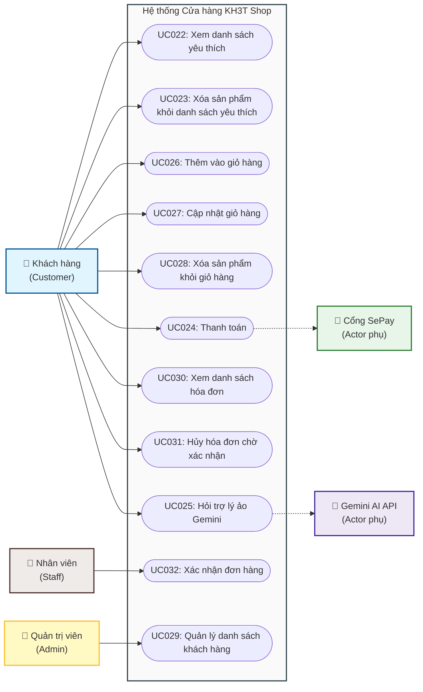

# Hệ thống Đặc tả Use Case - KH3T Shop

Tài liệu này tổng hợp đặc tả Use Case từ **UC022** đến **UC032** thuộc dự án **KH3T Shop** (bao gồm cả phần Backend Spring Boot và Frontend React).

---

## 1. Sơ đồ Use Case Tổng Thể (UML Use Case Diagram)

Dưới đây là sơ đồ biểu diễn các tác nhân (Actors) và mối quan hệ với các Use Case trong hệ thống.

---

## 2. Danh sách Đặc tả Use Case Chi tiết

Dưới đây là các đường dẫn đến tài liệu đặc tả chi tiết cho từng Use Case kèm theo **Biểu đồ hoạt động (Activity Diagram)** và **Biểu đồ tuần tự (Sequence Diagram)**:

### 🛍️ Nhóm sản phẩm yêu thích (Wishlist) & Giỏ hàng (Cart)
*   **[UC022: Xem danh sách yêu thích](UC022_Xem_danh_sach_yeu_thich.md)**: Cho phép khách hàng xem các sản phẩm đã lưu vào danh sách yêu thích.
*   **[UC023: Xóa sản phẩm khỏi danh sách yêu thích](UC023_Xoa_san_pham_yeu_thich.md)**: Xóa sản phẩm không còn muốn theo dõi khỏi danh sách yêu thích.
*   **[UC026: Thêm vào giỏ hàng](UC026_Them_vao_gio_hang.md)**: Thêm sản phẩm cùng size được chọn từ trang chi tiết sản phẩm vào giỏ hàng.
*   **[UC027: Cập nhật sản phẩm trong giỏ hàng](UC027_Cap_nhat_gio_hang.md)**: Tăng/giảm số lượng sản phẩm trực tiếp trong giỏ hàng.
*   **[UC028: Xóa sản phẩm khỏi giỏ hàng](UC028_Xoa_gio_hang.md)**: Xóa hoàn toàn một sản phẩm ra khỏi giỏ hàng.

### 💳 Nhóm Thanh toán & Quản lý đơn hàng (Order/Invoice)
*   **[UC024: Thanh toán](UC024_Thanh_toan.md)**: Thực hiện đặt hàng bằng tiền mặt (COD) hoặc chuyển khoản ngân hàng qua cổng SePay quét mã QR.
*   **[UC030: Xem danh sách hóa đơn](UC030_Xem_danh_sach_hoa_don.md)**: Khách hàng theo dõi danh sách các đơn hàng đã đặt và trạng thái thanh toán.
*   **[UC031: Hủy hóa đơn chờ xác nhận](UC031_Huy_hoa_don_cho_xac_nhan.md)**: Khách hàng hủy đơn hàng khi đơn hàng ở trạng thái chờ xác nhận.
*   **[UC032: Xác nhận đơn hàng](UC032_Xac_nhan_don_hang.md)**: Nhân viên cửa hàng xác nhận đơn hàng của khách và hệ thống sinh hóa đơn.

### 🤖 Nhóm Hỗ trợ AI & Quản trị (Admin)
*   **[UC025: Hỏi trợ lý ảo](UC025_Hoi_tro_ly_ao.md)**: Khách hàng trò chuyện với trợ lý ảo tích hợp Gemini AI để tìm kiếm thông tin sản phẩm.
*   **[UC029: Quản lý danh sách khách hàng](UC029_Quan_ly_khach_hang.md)**: Quản trị viên (Admin) xem và quản lý danh sách thông tin khách hàng trong hệ thống.
