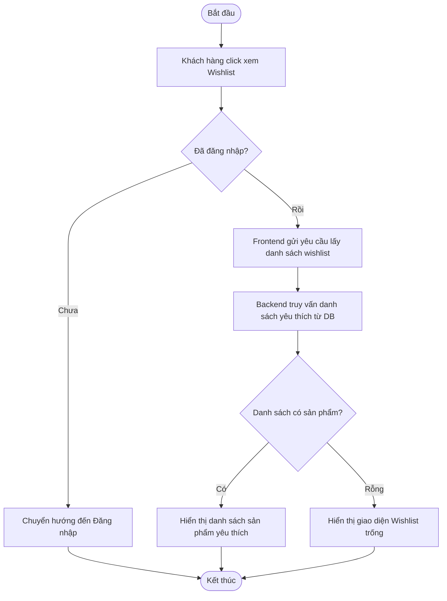

# UC022: Xem danh sách yêu thích

## 1. Biểu đồ hoạt động (Activity Diagram)



## 2. Biểu đồ tuần tự (Sequence Diagram)

```mermaid
sequenceDiagram
    autonumber
    actor KhachHang as Khách hàng
    participant FE as Frontend UI (React)
    participant BE as Backend Controller (Spring Boot)
    participant Service as WishList Service
    participant Repo as WishList Repository
    database DB as Database (MySQL)

    KhachHang->>FE: Click chọn mục Wishlist
    activate FE
    FE->>BE: GET /api/v1/wishlist (JWT Token)
    activate BE
    BE->>BE: Xác thực Token, lấy CustomerId
    BE->>Service: getWishlistByCustomerId(customerId)
    activate Service
    Service->>Repo: findByCustomerId(customerId)
    activate Repo
    Repo->>DB: SELECT * FROM wishlist WHERE customer_id = ?
    activate DB
    DB-->>Repo: Trả về dữ liệu Wishlist
    deactivate DB
    Repo-->>Service: Đối tượng WishList
    deactivate Repo
    Service-->>BE: WishListResponse DTO
    deactivate Service
    BE-->>FE: HTTP 200 OK (Danh sách sản phẩm yêu thích JSON)
    deactivate BE
    FE-->>KhachHang: Hiển thị danh sách sản phẩm yêu thích trên giao diện
    deactivate FE
```
