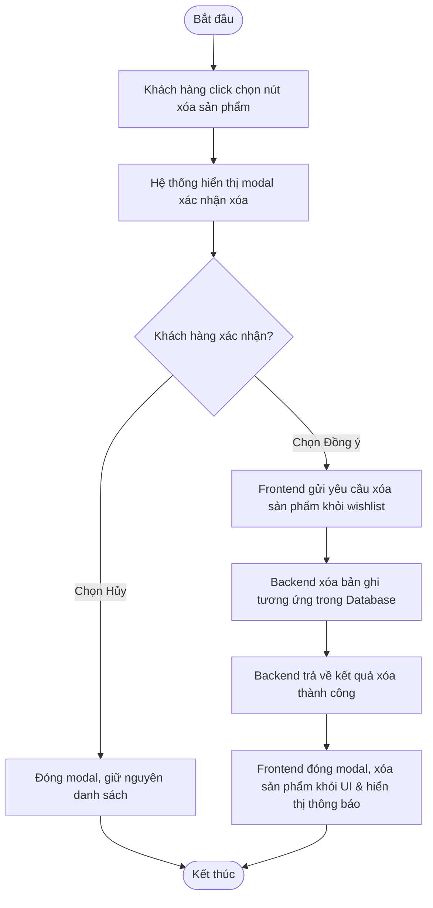

# UC023: Xóa sản phẩm khỏi danh sách yêu thích

## 1. Biểu đồ hoạt động (Activity Diagram)



## 2. Biểu đồ tuần tự (Sequence Diagram)

```mermaid
sequenceDiagram
    autonumber
    actor KhachHang as Khách hàng
    participant FE as Frontend UI (React)
    participant BE as Backend Controller (Spring Boot)
    participant Service as WishList Service
    participant Repo as WishListDetail Repository
    database DB as Database (MySQL)

    KhachHang->>FE: Click nút xóa (thùng rác) của một sản phẩm
    activate FE
    FE-->>KhachHang: Hiển thị modal xác nhận xóa
    deactivate FE
    
    alt Khách hàng chọn "Xác nhận" (Yes)
        KhachHang->>FE: Click nút "Xác nhận"
        activate FE
        FE->>BE: DELETE /api/v1/wishlist-detail/{detailId} (JWT Token)
        activate BE
        BE->>Service: removeWishlistDetail(detailId)
        activate Service
        Service->>Repo: deleteById(detailId)
        activate Repo
        Repo->>DB: DELETE FROM wishlist_detail WHERE id = ?
        activate DB
        DB-->>Repo: Xác nhận xóa thành công
        deactivate DB
        Repo-->>Service: Trả về trạng thái thành công
        deactivate Repo
        Service-->>BE: Hoàn thành xóa
        deactivate Service
        BE-->>FE: HTTP 200 OK (Xóa thành công)
        deactivate BE
        FE-->>KhachHang: Cập nhật danh sách trên UI & hiển thị Toast thông báo thành công
        deactivate FE
    else Khách hàng chọn "Hủy" (No)
        KhachHang->>FE: Click nút "Hủy"
        activate FE
        FE-->>KhachHang: Đóng modal, giữ nguyên danh sách
        deactivate FE
    end
```
