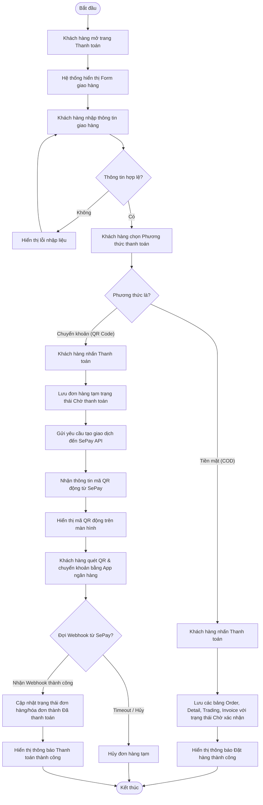

# UC024: Thanh toán

## 1. Biểu đồ hoạt động (Activity Diagram)



## 2. Biểu đồ tuần tự (Sequence Diagram)

```mermaid
sequenceDiagram
    autonumber
    actor KhachHang as Khách hàng
    participant FE as Frontend UI (React)
    participant BE as Backend Controller (Spring Boot)
    participant Service as Order & Payment Service
    database DB as Database (MySQL)
    participant SePay as SePay Gateway (API/Webhook)
    actor BankApp as App Ngân hàng

    KhachHang->>FE: Điền thông tin giao hàng, chọn hình thức thanh toán & ấn "Thanh toán"
    activate FE
    
    alt Trường hợp 1: Chọn thanh toán Tiền mặt (COD)
        FE->>BE: POST /api/v1/orders/checkout (Kèm thông tin giao hàng & phương thức COD)
        activate BE
        BE->>Service: createOrderCOD(dto)
        activate Service
        Service->>DB: Lưu các thực thể (Order, OrderDetail, CustomerTrading, Invoice)
        activate DB
        DB-->>Service: Lưu thành công
        deactivate DB
        Service-->>BE: Đối tượng OrderResponseDTO (Trạng thái: Chờ xác nhận)
        deactivate Service
        BE-->>FE: HTTP 200 OK (Thành công)
        deactivate BE
        FE-->>KhachHang: Clear giỏ hàng, hiển thị trang Đặt hàng thành công
        
    else Trường hợp 2: Chọn thanh toán Chuyển khoản (SePay QR)
        FE->>BE: POST /api/v1/orders/checkout (Kèm thông tin giao hàng & phương thức QR)
        activate BE
        BE->>Service: createOrderQR(dto)
        activate Service
        Service->>DB: Lưu thông tin đơn hàng tạm (Trạng thái: Chờ thanh toán)
        activate DB
        DB-->>Service: Lưu thành công
        deactivate DB
        Service->>SePay: POST /api/v1/sepay/payment-request (Số tiền, Mã đơn hàng)
        activate SePay
        SePay-->>Service: Trả về link ảnh QR động
        deactivate SePay
        Service-->>BE: Đối tượng QRResponseDTO
        deactivate Service
        BE-->>FE: HTTP 200 OK (Kèm dữ liệu QR Code)
        deactivate BE
        FE-->>KhachHang: Hiển thị trang thanh toán QR
        
        KhachHang->>BankApp: Quét QR và thực hiện chuyển tiền
        activate BankApp
        BankApp-->>SePay: Chuyển tiền thành công
        deactivate BankApp
        
        SePay->>BE: POST /api/v1/sepay/webhook (Nội dung khớp đơn hàng)
        activate BE
        BE->>Service: verifyAndProcessPayment(webhookData)
        activate Service
        Service->>DB: UPDATE orders/invoices SET status = 'Đã thanh toán' WHERE order_id = ?
        activate DB
        DB-->>Service: Cập nhật thành công
        deactivate DB
        Service-->>BE: Hoàn thành đối soát & xác nhận
        deactivate Service
        BE-->>SePay: HTTP 200 OK
        deactivate BE
        
        FE->>BE: GET /api/v1/orders/{orderId}/status
        activate BE
        BE-->>FE: Trả về trạng thái "Đã thanh toán"
        deactivate BE
        FE-->>KhachHang: Tự động chuyển trang hiển thị "Thanh toán thành công!"
        deactivate FE
    end
```
