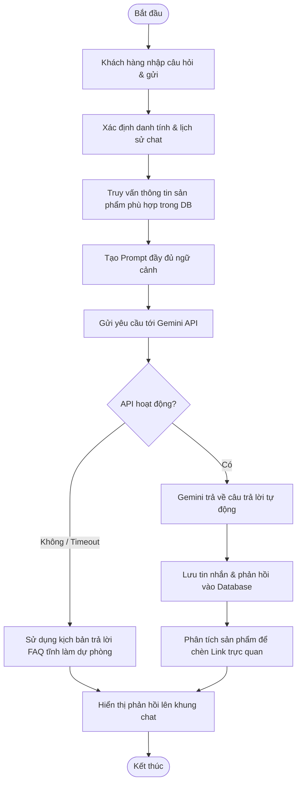

# UC025: Hỏi trợ lý ảo

## 1. Biểu đồ hoạt động (Activity Diagram)



## 2. Biểu đồ tuần tự (Sequence Diagram)

```mermaid
sequenceDiagram
    autonumber
    actor KhachHang as Khách hàng
    participant FE as Frontend Chat UI (React)
    participant BE as Backend Controller (Spring Boot)
    participant Service as ChatService
    database DB as Database (MySQL)
    participant Gemini as Gemini AI (Google API)

    KhachHang->>FE: Nhập tin nhắn cần hỏi, nhấn Gửi
    activate FE
    FE->>BE: POST /api/v1/chat/send (Message, SessionId)
    activate BE
    BE->>Service: processChatMessage(message, sessionId)
    activate Service
    
    Service->>DB: Lấy lịch sử chat gần đây & Tìm sản phẩm phù hợp qua từ khóa
    activate DB
    DB-->>Service: Trả về danh sách chat & dữ liệu sản phẩm mẫu
    deactivate DB
    
    Service->>Service: Ghép Prompt (Context + Chat History + New Message)
    Service->>Gemini: POST /v1beta/models/gemini-pro:generateContent (Prompt)
    activate Gemini
    Gemini-->>Service: HTTP 200 OK (Nội dung câu trả lời JSON)
    deactivate Gemini
    
    Service->>DB: INSERT INTO chat_history (sender, message)
    activate DB
    DB-->>Service: Lưu thành công
    deactivate DB
    
    Service-->>BE: Đối tượng ChatResponseDTO
    deactivate Service
    BE-->>FE: HTTP 200 OK (Chat DTO)
    deactivate BE
    FE-->>KhachHang: Hiển thị phản hồi của Bot và link sản phẩm gợi ý
    deactivate FE
```
