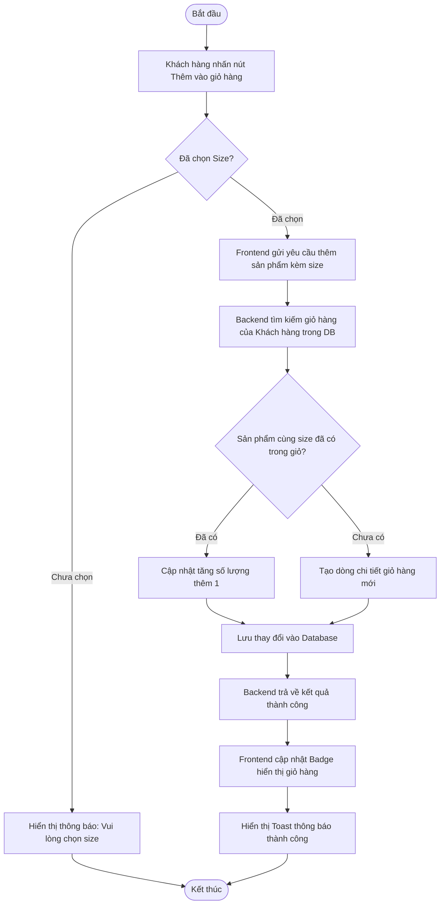

# UC026: Thêm vào giỏ hàng

## 1. Biểu đồ hoạt động (Activity Diagram)



## 2. Biểu đồ tuần tự (Sequence Diagram)

```mermaid
sequenceDiagram
    autonumber
    actor KhachHang as Khách hàng
    participant FE as Frontend UI (React)
    participant BE as Backend Controller (Spring Boot)
    participant Service as Cart Service
    participant Repo as CartDetail Repository
    database DB as Database (MySQL)

    KhachHang->>FE: Chọn size và bấm nút "Thêm vào giỏ hàng"
    activate FE
    FE->>FE: Kiểm tra giá trị size đã chọn
    
    alt Trường hợp chưa chọn size
        FE-->>KhachHang: Hiển thị Toast cảnh báo: "Vui lòng chọn size"
    else Trường hợp đã chọn size hợp lệ
        FE->>BE: POST /api/v1/cart/add (productId, sizeId, quantity=1) (JWT Token)
        activate BE
        BE->>BE: Xác thực Token, lấy CustomerId
        BE->>Service: addProductToCart(customerId, productId, sizeId, quantity)
        activate Service
        
        Service->>DB: Lấy Cart của khách hàng (hoặc tạo mới)
        activate DB
        DB-->>Service: Trả về đối tượng Cart
        deactivate DB
        
        Service->>Repo: findByCartIdAndProductIdAndSizeId(cartId, productId, sizeId)
        activate Repo
        Repo->>DB: SELECT * FROM cart_details WHERE cart_id = ? AND product_id = ? AND size_id = ?
        activate DB
        DB-->>Repo: Trả về bản ghi CartDetail (nếu có)
        deactivate DB
        Repo-->>Service: Đối tượng CartDetail (hoặc null)
        deactivate Repo
        
        alt Sản phẩm cùng size đã tồn tại trong giỏ
            Service->>Service: Tăng số lượng (quantity = currentQuantity + newQuantity)
        else Sản phẩm cùng size chưa có trong giỏ
            Service->>Service: Tạo thực thể CartDetail mới
        end
        
        Service->>Repo: save(cartDetail)
        activate Repo
        Repo->>DB: INSERT/UPDATE cart_details VALUES (...)
        activate DB
        DB-->>Repo: Xác nhận lưu thành công
        deactivate DB
        Repo-->>Service: Thực thể đã lưu
        deactivate Repo
        
        Service-->>BE: Hoàn tất thêm vào giỏ
        deactivate Service
        BE-->>FE: HTTP 200 OK (Thành công)
        deactivate BE
        FE->>FE: Cập nhật state Cart Badge trên Header
        FE-->>KhachHang: Hiển thị thông báo "Thêm vào giỏ hàng thành công!"
    end
    deactivate FE
```
