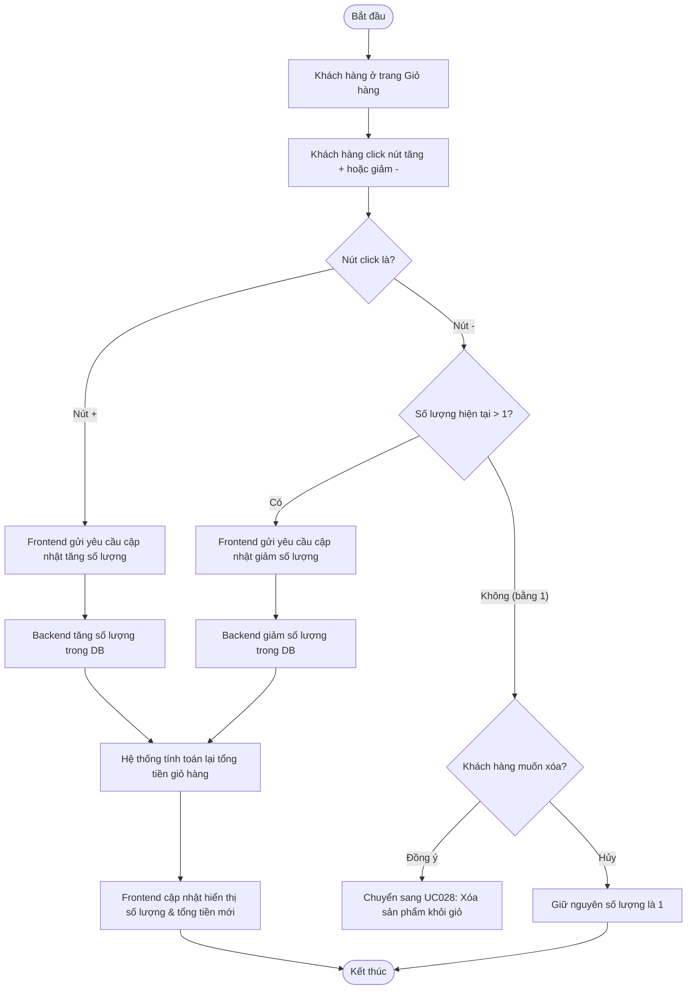

# UC027: Cập nhật sản phẩm trong giỏ hàng

## 1. Biểu đồ hoạt động (Activity Diagram)



## 2. Biểu đồ tuần tự (Sequence Diagram)

```mermaid
sequenceDiagram
    autonumber
    actor KhachHang as Khách hàng
    participant FE as Frontend Cart UI (React)
    participant BE as Backend Controller (Spring Boot)
    participant Service as Cart Service
    participant Repo as CartDetail Repository
    database DB as Database (MySQL)

    KhachHang->>FE: Nhấn nút Tăng (+) hoặc Giảm (-) số lượng
    activate FE
    
    alt Trường hợp click nút giảm (-) và số lượng hiện tại = 1
        FE-->>KhachHang: Hiển thị popup hỏi: "Bạn có muốn xóa sản phẩm?"
        alt Khách hàng nhấn "Đồng ý"
            Note over FE, DB: Luồng chuyển tiếp sang UC028
        else Khách hàng nhấn "Hủy"
            FE-->>KhachHang: Giữ nguyên số lượng là 1
        end
        
    else Luồng cập nhật thông thường (+ hoặc - khi qty > 1)
        FE->>BE: PUT /api/v1/cart/detail/{detailId} (Kèm số lượng mới) (JWT Token)
        activate BE
        BE->>Service: updateCartDetailQuantity(detailId, quantity)
        activate Service
        Service->>Repo: findById(detailId)
        activate Repo
        Repo->>DB: SELECT * FROM cart_details WHERE id = ?
        activate DB
        DB-->>Repo: Trả về đối tượng CartDetail
        deactivate DB
        Repo-->>Service: Đối tượng CartDetail
        deactivate Repo
        
        Service->>Service: Cập nhật quantity
        Service->>Repo: save(cartDetail)
        activate Repo
        Repo->>DB: UPDATE cart_details SET quantity = ? WHERE id = ?
        activate DB
        DB-->>Repo: Lưu thành công
        deactivate DB
        Repo-->>Service: Đối tượng đã cập nhật
        deactivate Repo
        
        Service-->>BE: Hoàn tất cập nhật
        deactivate Service
        BE-->>FE: HTTP 200 OK (Trả về giỏ hàng mới)
        deactivate BE
        FE->>FE: Tính toán lại tổng tiền giỏ hàng
        FE-->>KhachHang: Hiển thị số lượng và tổng tiền mới trên giao diện
    end
    deactivate FE
```
