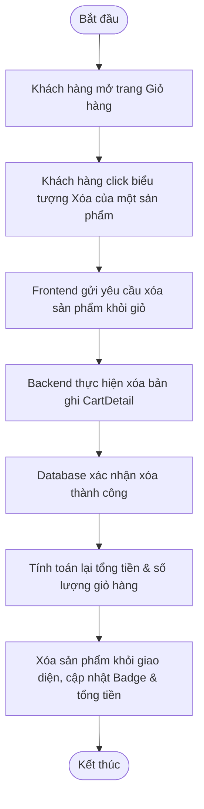

# UC028: Xóa sản phẩm khỏi giỏ hàng

## 1. Biểu đồ hoạt động (Activity Diagram)



## 2. Biểu đồ tuần tự (Sequence Diagram)

```mermaid
sequenceDiagram
    autonumber
    actor KhachHang as Khách hàng
    participant FE as Frontend Cart UI (React)
    participant BE as Backend Controller (Spring Boot)
    participant Service as Cart Service
    participant Repo as CartDetail Repository
    database DB as Database (MySQL)

    KhachHang->>FE: Nhấn chọn nút Xóa (biểu tượng thùng rác)
    activate FE
    FE->>BE: DELETE /api/v1/cart/detail/{detailId} (JWT Token)
    activate BE
    BE->>BE: Xác thực Token
    BE->>Service: removeCartDetail(detailId)
    activate Service
    Service->>Repo: deleteById(detailId)
    activate Repo
    Repo->>DB: DELETE FROM cart_details WHERE id = ?
    activate DB
    DB-->>Repo: Xác nhận xóa thành công
    deactivate DB
    Repo-->>Service: Hoàn thành xóa
    deactivate Repo
    Service-->>BE: Hoàn tất xử lý
    deactivate Service
    BE-->>FE: HTTP 200 OK (Thành công)
    deactivate BE
    FE->>FE: Tính lại tổng tiền giỏ hàng & số lượng
    FE->>FE: Cập nhật state Cart Badge trên Header
    FE-->>KhachHang: Xóa dòng sản phẩm khỏi giao diện và hiển thị giá tiền mới
    deactivate FE
```
