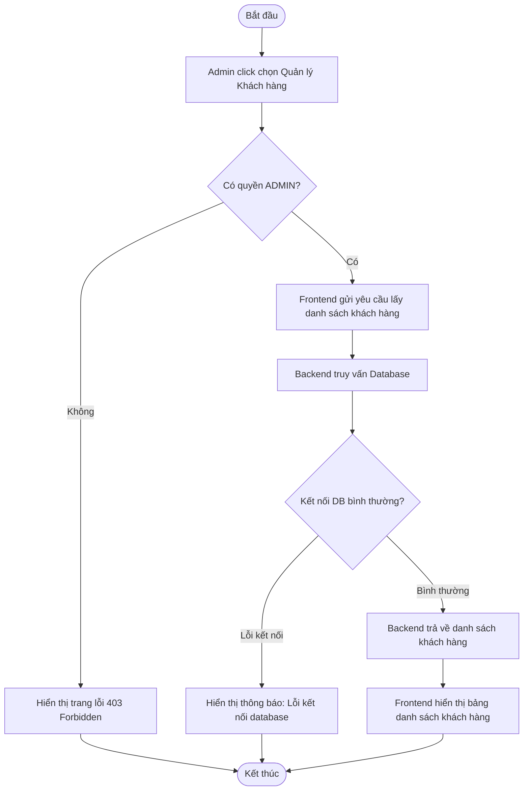

# UC029: Quản Lý Danh Sách Khách Hàng

## 1. Biểu đồ hoạt động (Activity Diagram)



## 2. Biểu đồ tuần tự (Sequence Diagram)

```mermaid
sequenceDiagram
    autonumber
    actor Admin as Quản trị viên
    participant FE as Admin Portal UI (React)
    participant BE as Backend Controller (Spring Boot)
    participant Service as Customer Service
    participant Repo as Customer Repository
    database DB as Database (MySQL)

    Admin->>FE: Click chọn mục "Quản lý khách hàng"
    activate FE
    FE->>BE: GET /api/v1/admin/customers (JWT Token)
    activate BE
    BE->>BE: Kiểm tra phân quyền ADMIN
    
    alt Trường hợp 1: Không có quyền ADMIN
        BE-->>FE: HTTP 403 Forbidden
        FE-->>Admin: Hiển thị lỗi truy cập (403 Forbidden)
    else Trường hợp 2: Có quyền ADMIN hợp lệ
        BE->>Service: getAllCustomers()
        activate Service
        Service->>Repo: findAll()
        activate Repo
        
        alt Kết nối Database gặp lỗi
            Repo->>DB: Truy vấn dữ liệu
            activate DB
            DB-->>Repo: Ném ngoại lệ cơ sở dữ liệu
            deactivate DB
            Repo-->>Service: Lỗi
            deactivate Repo
            Service-->>BE: Lỗi hệ thống
            deactivate Service
            BE-->>FE: HTTP 500 Internal Server Error
            FE-->>Admin: Hiển thị Toast thông báo lỗi hệ thống
        else Cơ sở dữ liệu kết nối bình thường
            Repo->>DB: SELECT * FROM customer c JOIN account a ON c.account_id = a.id
            activate DB
            DB-->>Repo: Trả về danh sách khách hàng
            deactivate DB
            Repo-->>Service: Danh sách đối tượng Customer
            activate Repo
            deactivate Repo
            Service-->>BE: Danh sách CustomerResponseDTO
            activate Service
            deactivate Service
            BE-->>FE: HTTP 200 OK (Mảng dữ liệu khách hàng JSON)
            deactivate BE
            FE-->>Admin: Hiển thị bảng danh sách khách hàng
        end
    end
    deactivate FE
```
