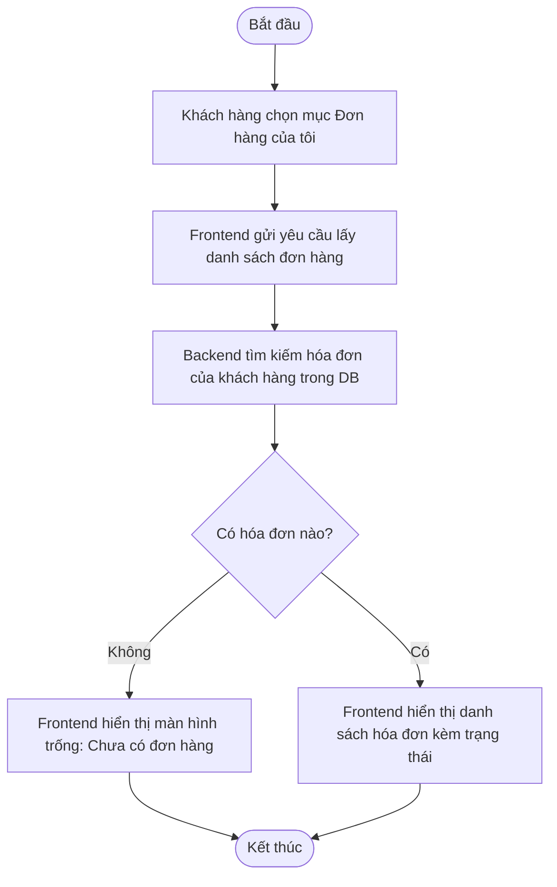

# UC030: Xem Danh Sách Hóa Đơn

## 1. Biểu đồ hoạt động (Activity Diagram)



## 2. Biểu đồ tuần tự (Sequence Diagram)

```mermaid
sequenceDiagram
    autonumber
    actor KhachHang as Khách hàng
    participant FE as Frontend UI (React)
    participant BE as Backend Controller (Spring Boot)
    participant Service as Order Service
    participant Repo as Order Repository
    database DB as Database (MySQL)

    KhachHang->>FE: Click chọn mục "Đơn hàng của tôi" (My Orders)
    activate FE
    FE->>BE: GET /api/v1/orders/my-orders (JWT Token)
    activate BE
    BE->>BE: Xác thực token và lấy CustomerId
    BE->>Service: getOrdersByCustomerId(customerId)
    activate Service
    Service->>Repo: findByCustomerId(customerId)
    activate Repo
    Repo->>DB: SELECT * FROM orders WHERE customer_id = ? ORDER BY created_at DESC
    activate DB
    DB-->>Repo: Trả về danh sách đơn hàng
    deactivate DB
    Repo-->>Service: Mảng thực thể Order
    deactivate Repo
    Service-->>BE: Mảng OrderResponseDTO
    deactivate Service
    BE-->>FE: HTTP 200 OK (Danh sách đơn hàng JSON)
    deactivate BE
    
    alt Trường hợp danh sách rỗng
        FE-->>KhachHang: Hiển thị giao diện "Bạn chưa có đơn hàng nào"
    else Trường hợp có đơn hàng
        FE-->>KhachHang: Render danh sách đơn hàng
    end
    deactivate FE
```
