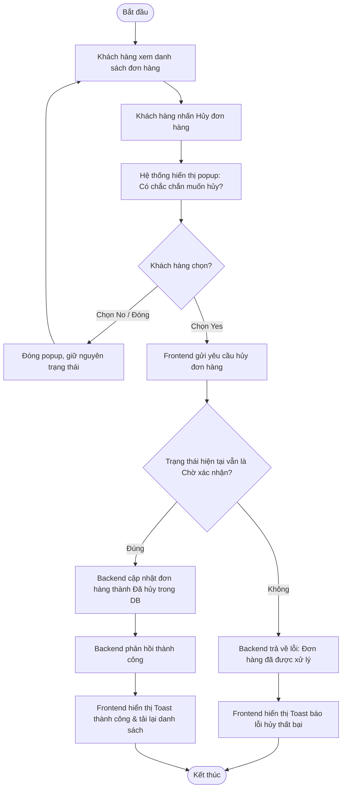

# UC031: Hủy hóa đơn chờ xác nhận

## 1. Biểu đồ hoạt động (Activity Diagram)



## 2. Biểu đồ tuần tự (Sequence Diagram)

```mermaid
sequenceDiagram
    autonumber
    actor KhachHang as Khách hàng
    participant FE as Frontend UI (React)
    participant BE as Backend Controller (Spring Boot)
    participant Service as Order Service
    participant Repo as Order Repository
    database DB as Database (MySQL)

    KhachHang->>FE: Click nút "Hủy đơn" trên đơn hàng chờ xác nhận
    activate FE
    FE-->>KhachHang: Hiển thị popup xác nhận: "Có chắc chắn muốn hủy?"
    deactivate FE

    alt Khách hàng chọn "No"
        KhachHang->>FE: Click "No"
        activate FE
        FE-->>KhachHang: Đóng popup, giữ nguyên danh sách
        deactivate FE
        
    else Khách hàng chọn "Yes"
        KhachHang->>FE: Click "Yes"
        activate FE
        FE->>BE: POST /api/v1/orders/{orderId}/cancel (JWT Token)
        activate BE
        BE->>BE: Xác thực Token, kiểm tra quyền sở hữu đơn hàng
        BE->>Service: cancelPendingOrder(orderId, customerId)
        activate Service
        Service->>Repo: findById(orderId)
        activate Repo
        Repo->>DB: SELECT * FROM orders WHERE id = ?
        activate DB
        DB-->>Repo: Thực thể Order
        deactivate DB
        Repo-->>Service: Đối tượng Order
        deactivate Repo
        
        alt Trạng thái đơn hàng không phải là PENDING_CONFIRMATION
            Service-->>BE: Ném ngoại lệ IllegalStateException
            BE-->>FE: HTTP 400 Bad Request
            FE-->>KhachHang: Hiển thị Toast thông báo hủy thất bại
        else Trạng thái hợp lệ (PENDING_CONFIRMATION)
            Service->>Service: Đổi trạng thái thành CANCELLED
            Service->>Repo: save(order)
            activate Repo
            Repo->>DB: UPDATE orders SET status = 'CANCELLED' WHERE id = ?
            activate DB
            DB-->>Repo: Xác nhận cập nhật thành công
            deactivate DB
            Repo-->>Service: Thực thể đã lưu
            deactivate Repo
            Service-->>BE: Hoàn tất hủy đơn
            deactivate Service
            BE-->>FE: HTTP 200 OK (Hủy thành công)
            deactivate BE
            FE->>FE: Tải lại danh sách đơn hàng
            FE-->>KhachHang: Cập nhật giao diện đơn hàng đã hủy
        end
    end
    deactivate FE
```
