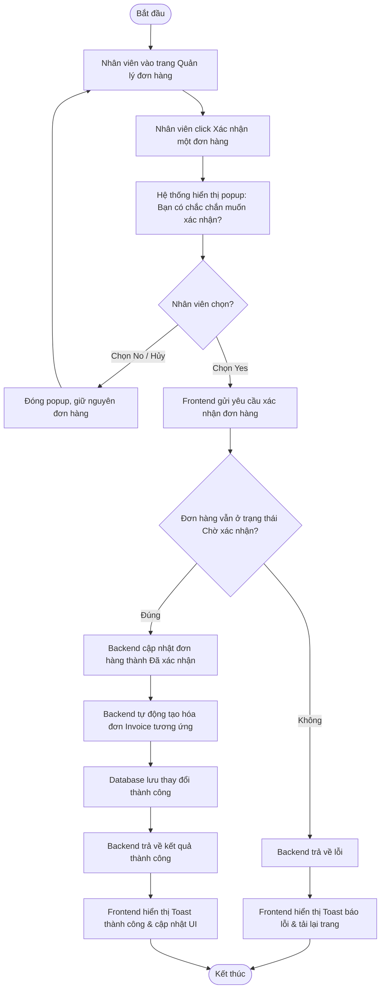

# UC032: Xác nhận đơn hàng

## 1. Biểu đồ hoạt động (Activity Diagram)



## 2. Biểu đồ tuần tự (Sequence Diagram)

```mermaid
sequenceDiagram
    autonumber
    actor Staff as Nhân viên (Staff)
    participant FE as Staff Dashboard UI (React)
    participant BE as Backend Controller (Spring Boot)
    participant Service as Order & Invoice Service
    participant OrderRepo as Order Repository
    participant InvoiceRepo as Invoice Repository
    database DB as Database (MySQL)

    Staff->>FE: Click nút "Xác nhận" của đơn hàng chờ duyệt
    activate FE
    FE-->>Staff: Hiển thị popup hỏi: "Có chắc chắn muốn xác nhận đơn hàng?"
    deactivate FE

    alt Nhân viên chọn "No"
        Staff->>FE: Click "No"
        activate FE
        FE-->>Staff: Đóng popup, giữ nguyên giao diện
        deactivate FE
        
    else Nhân viên chọn "Yes"
        Staff->>FE: Click "Yes"
        activate FE
        FE->>BE: POST /api/v1/staff/orders/{orderId}/confirm (JWT Token)
        activate BE
        BE->>BE: Xác thực Token, kiểm tra quyền STAFF
        BE->>Service: confirmOrderAndGenerateInvoice(orderId)
        activate Service
        
        Service->>OrderRepo: findById(orderId)
        activate OrderRepo
        OrderRepo->>DB: SELECT * FROM orders WHERE id = ?
        activate DB
        DB-->>OrderRepo: Thực thể Order
        deactivate DB
        OrderRepo-->>Service: Đối tượng Order
        deactivate OrderRepo
        
        alt Đơn hàng không còn ở trạng thái chờ duyệt
            Service-->>BE: Ném ngoại lệ IllegalStateException
            BE-->>FE: HTTP 400 Bad Request
            FE-->>Staff: Hiển thị Toast thông báo lỗi & reload
        else Trạng thái hợp lệ (Chờ xác nhận)
            Service->>Service: Đổi trạng thái đơn hàng sang "Đã xác nhận"
            Service->>OrderRepo: save(order)
            activate OrderRepo
            OrderRepo->>DB: UPDATE orders SET status = 'CONFIRMED' WHERE id = ?
            activate DB
            DB-->>OrderRepo: Cập nhật thành công
            deactivate DB
            OrderRepo-->>Service: Thực thể đã lưu
            deactivate OrderRepo
            
            Service->>Service: Khởi tạo thực thể Invoice
            Service->>InvoiceRepo: save(invoice)
            activate InvoiceRepo
            InvoiceRepo->>DB: INSERT INTO invoices (invoice_no, amount, status, order_id, ...) VALUES (...)
            activate DB
            DB-->>InvoiceRepo: Lưu hóa đơn thành công
            deactivate DB
            InvoiceRepo-->>Service: Thực thể Invoice đã lưu
            deactivate InvoiceRepo
            
            Service-->>BE: Hoàn tất duyệt đơn & tạo hóa đơn
            deactivate Service
            BE-->>FE: HTTP 200 OK (Xác nhận thành công)
            deactivate BE
            FE->>FE: Cập nhật danh sách trên UI
            FE-->>Staff: Hiển thị thông báo xác nhận thành công
        end
    end
    deactivate FE
```
